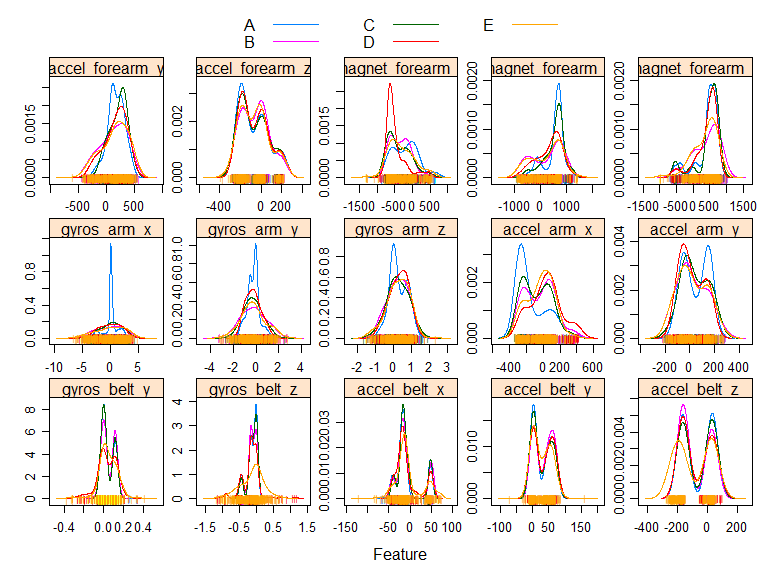
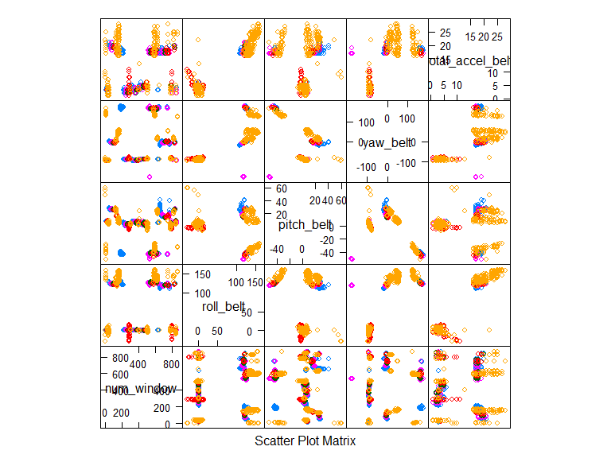
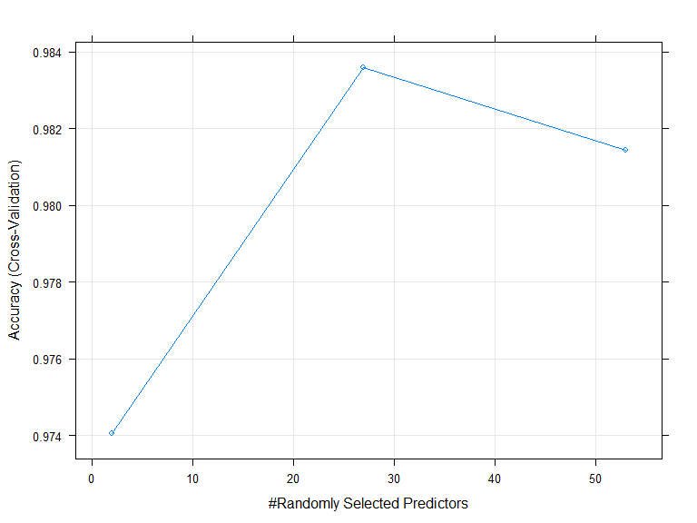
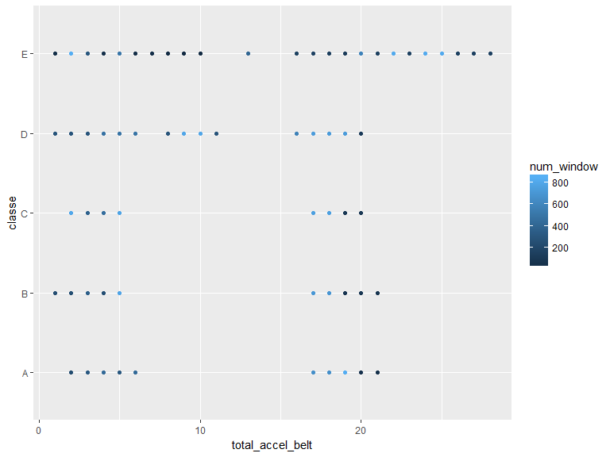
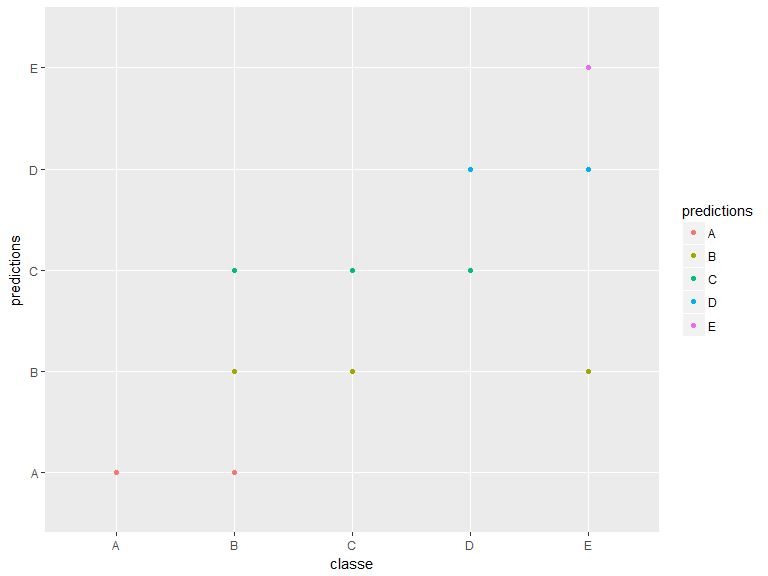

# ML_Excerise_Prediction
Kenney Snell  
December 10, 2017  


##Introduction
Devices such as Jawbone Up, Nike FuelBand, and Fitbit make it easy to collect a large amount of data about personal exercise activity relatively inexpensively.   One thing that people regularly do is quantify how much of a particular activity they do, but they rarely quantify how well they do it

##Project Goal
The goal of this project is to predict the manner in which they did the exercise. This is the "classe" variable in the training set. Choose both the machine learning method and the variables to predict the variable "classe".


##Describe the data
Use this data for training and cross validaiton.

The training data for this project are available here: 
https://d396qusza40orc.cloudfront.net/predmachlearn/pml-training.csv

Use this data for the final prediction.

The test data are available here:
https://d396qusza40orc.cloudfront.net/predmachlearn/pml-testing.csv


##Processing (Get data and set up)  


```r
# Read Training data
library(caret)
```

```
## Loading required package: lattice
```

```
## Loading required package: ggplot2
```

```r
library(ggplot2)
library(forecast)
# Remove that has any divide by zero.
# set all fact data to integer or number.
train_in = read.csv("C://Users//app1kms//Documents//Training//2017//DataScience_Downloads//ML//pml-training.csv", stringsAsFactors = FALSE, na.strings = c("#DIV/0!"))
#str(train_in)
# Read Testing data
testing = read.csv("C://Users//app1kms//Documents//Training//2017//DataScience_Downloads//ML//pml-testing.csv")
# str(testing)

set.seed(1765)

# Sample 6000 rows out of original training data
# set to 1000 for now
train_in.sample <- sample(nrow(train_in), 6000)
train_in.subset <- train_in[train_in.sample, ]

# Remove columns with 2/3 of the data missing (NA) and columnns that are character data 
train_in.drop <- train_in.subset[, colSums(is.na(train_in.subset)) < 107]  #Columns with 2/3 (107) NA values
train_in.drop_chr <- train_in.drop[, !sapply(train_in.drop, is.character)]  #Columns of 'character'' type
# str(train_in.drop_chr)

training_data <- train_in.drop_chr[, 4:56]  #Remove other irrelevant columns through manual inspection
# remoe first 4 colums (names, etc.)

training_data$classe <- as.factor(train_in.subset$classe)  #Re-insert classe column, convert to factor


# createDataPartition: Subset 30% of training data for cross-validation

# Create a building data set and validation set
trainIndex <- createDataPartition(y = training_data$classe, p = 0.7, list = FALSE)
train_build <- training_data[trainIndex, ]
#str(train_build)
train_validation <- training_data[-trainIndex, ]
str(train_validation)
```

```
## 'data.frame':	1798 obs. of  54 variables:
##  $ num_window          : int  850 327 198 723 690 40 680 424 831 54 ...
##  $ roll_belt           : num  1.42 1.4 122 119 115 -3 117 0.78 122 124 ...
##  $ pitch_belt          : num  7.92 7.5 -42.8 14 18.6 5.06 16.5 4.81 25.6 26.6 ...
##  $ yaw_belt            : num  -93.4 -93.9 169 2.9 -7.84 -92.9 0.92 -87.8 -6.33 -1.92 ...
##  $ total_accel_belt    : int  3 3 17 17 17 3 17 4 20 20 ...
##  $ gyros_belt_x        : num  0.11 0.03 0.11 0.18 0.03 0.06 0.1 0.08 -0.56 -0.55 ...
##  $ gyros_belt_y        : num  0 0.02 0.11 0.11 0.11 0.05 0.13 0 -0.02 -0.02 ...
##  $ gyros_belt_z        : num  0.02 -0.05 -0.2 -0.13 -0.15 0.39 -0.18 0.02 -0.48 -0.46 ...
##  $ accel_belt_x        : int  -19 -22 48 -20 -20 -20 -22 -13 -37 -38 ...
##  $ accel_belt_y        : int  4 4 44 60 62 -5 65 5 71 68 ...
##  $ accel_belt_z        : int  23 23 -158 -158 -155 27 -157 36 -176 -178 ...
##  $ magnet_belt_x       : int  4 2 165 25 8 -6 21 47 10 6 ...
##  $ magnet_belt_y       : int  604 607 615 599 605 615 609 638 583 579 ...
##  $ magnet_belt_z       : int  -304 -312 -300 -309 -320 -264 -313 -318 -368 -383 ...
##  $ roll_arm            : num  70.9 -140 179 -95.7 -29.9 79.5 -26.6 0 51.2 161 ...
##  $ pitch_arm           : num  7.19 6.1 82.1 -18.1 -23 -26.2 1.13 0 -21.9 -36.2 ...
##  $ yaw_arm             : num  64 -170 -82.4 60.1 -35.6 48.9 -54.3 0 165 34.3 ...
##  $ total_accel_arm     : int  24 34 28 41 4 18 12 18 11 37 ...
##  $ gyros_arm_x         : num  -2.36 0.02 0.34 0.1 2.09 -4.32 1.88 -2.2 1.01 1.4 ...
##  $ gyros_arm_y         : num  1.03 -0.02 -0.39 -0.72 -1.41 1.83 -1.17 0.82 -0.71 -0.98 ...
##  $ gyros_arm_z         : num  -0.11 -0.02 0.92 0.75 0.85 -1 0.69 -0.2 0.11 0.05 ...
##  $ accel_arm_x         : int  -182 -289 -273 101 17 -85 -101 68 59 359 ...
##  $ accel_arm_y         : int  149 110 -43 -184 -36 146 -31 104 7 9 ...
##  $ accel_arm_z         : int  -31 -126 -23 -345 -3 31 54 -125 94 62 ...
##  $ magnet_arm_x        : int  160 -364 -316 360 571 527 286 723 -196 678 ...
##  $ magnet_arm_y        : int  281 338 273 -107 171 105 225 10 368 161 ...
##  $ magnet_arm_z        : int  564 506 625 -504 349 422 554 157 555 210 ...
##  $ roll_dumbbell       : num  -73.85 95.53 58.09 -108.23 -5.23 ...
##  $ pitch_dumbbell      : num  -31.1 42.1 -27.8 -45.7 -10.5 ...
##  $ yaw_dumbbell        : num  73.9 -42.1 -91 16 145.4 ...
##  $ total_accel_dumbbell: int  2 1 18 6 4 7 2 29 10 11 ...
##  $ gyros_dumbbell_x    : num  0 0.35 0.22 0.19 -0.08 0.16 -0.37 0.05 0.45 0.61 ...
##  $ gyros_dumbbell_y    : num  0.16 0.39 0.27 0.32 0.08 -0.85 0.1 0.37 -0.22 0.1 ...
##  $ gyros_dumbbell_z    : num  0.02 -0.13 0.08 -0.26 0.03 0.28 0.05 -0.02 -0.3 -0.64 ...
##  $ accel_dumbbell_x    : int  -5 6 -49 -25 -4 24 -3 -146 18 14 ...
##  $ accel_dumbbell_y    : int  -11 12 98 -50 -2 51 13 146 -12 -38 ...
##  $ accel_dumbbell_z    : int  11 -6 -141 9 38 35 17 -193 97 97 ...
##  $ magnet_dumbbell_x   : int  -574 -512 -514 -460 -500 -498 -479 -507 531 495 ...
##  $ magnet_dumbbell_y   : int  245 360 335 416 365 369 382 360 -515 -557 ...
##  $ magnet_dumbbell_z   : num  25 -62 48 -23 -137 -1 -188 11 -43 -54 ...
##  $ roll_forearm        : num  -161 13.8 0 35.7 29.7 178 -10.6 77.1 157 90.4 ...
##  $ pitch_forearm       : num  50.2 -63.7 0 15.8 16.6 48.1 33.3 -2.59 35 4.38 ...
##  $ yaw_forearm         : num  -140 -138 0 -56.6 -90 -156 -136 113 171 102 ...
##  $ total_accel_forearm : int  24 36 48 14 17 20 35 40 27 35 ...
##  $ gyros_forearm_x     : num  -0.5 0 1.3 -0.26 0.61 0.29 0.39 1.36 0.32 0.11 ...
##  $ gyros_forearm_y     : num  0.29 -0.02 -0.03 0.69 -1.61 3.31 -1.77 -3.52 -2.34 0.02 ...
##  $ gyros_forearm_z     : num  -0.48 -0.03 0.8 0.08 -0.28 1.49 -0.87 -0.49 -0.18 -0.02 ...
##  $ accel_forearm_x     : int  -55 191 2 -82 -91 -78 -335 215 -146 138 ...
##  $ accel_forearm_y     : int  -138 208 467 111 136 25 27 303 125 242 ...
##  $ accel_forearm_z     : int  -182 -215 -51 -4 25 -175 38 -115 -187 -192 ...
##  $ magnet_forearm_x    : int  -535 -20 -131 -148 -243 -577 -657 -296 -700 -164 ...
##  $ magnet_forearm_y    : num  -171 662 742 729 773 -91 559 795 191 750 ...
##  $ magnet_forearm_z    : num  404 479 428 504 611 420 652 872 506 575 ...
##  $ classe              : Factor w/ 5 levels "A","B","C","D",..: 3 1 1 3 2 5 1 1 3 1 ...
```

```r
####### Data to be used
dim(train_build)
```

```
## [1] 4202   54
```

```r
dim(testing)
```

```
## [1]  20 160
```

```r
dim(train_validation)
```

```
## [1] 1798   54
```


##Model choice and method used how you build the model 
Use the caret package and set the method to Random forest.  This will help flush out the many variables to make a better prediction.


```r
library(caret)
library(ggplot2)
library(forecast)
modelfit <- train(classe ~.,method="rf",
              data=train_build, 
             trControl = trainControl(method="cv"),number=3,trace = TRUE)
```

```
## randomForest 4.6-12
```

```
## Type rfNews() to see new features/changes/bug fixes.
```

```
## 
## Attaching package: 'randomForest'
```

```
## The following object is masked from 'package:ggplot2':
## 
##     margin
```

```r
modelfit$finalModel
```

```
## 
## Call:
##  randomForest(x = x, y = y, mtry = param$mtry, number = 3, trace = TRUE) 
##                Type of random forest: classification
##                      Number of trees: 500
## No. of variables tried at each split: 27
## 
##         OOB estimate of  error rate: 1.29%
## Confusion matrix:
##      A   B   C   D   E class.error
## A 1203   0   1   0   1 0.001659751
## B   11 779  11   0   0 0.027465668
## C    0   6 727   3   0 0.012228261
## D    0   0  11 670   3 0.020467836
## E    0   2   0   5 769 0.009020619
```


##Expected out of sample error

From the output above the error rate is 1.29%.  This used the training (build) set of data.  This process used over 4000 cases.  I am hoping that the model is not performing overfitting.


##Cross validation
I used almost 1800 cases for the vlaidatations training (train_validation).

You can see the results from the confusion matrix.  The Sensitivity and the Specificity are near 1.0


```r
library(caret)
library(ggplot2)
library(forecast)

predictions <- predict(modelfit, newdata = train_validation)

confusionMatrix(predictions, train_validation$classe)
```

```
## Confusion Matrix and Statistics
## 
##           Reference
## Prediction   A   B   C   D   E
##          A 516   7   0   0   0
##          B   0 333   1   0   2
##          C   0   2 314   6   0
##          D   0   0   0 287   4
##          E   0   0   0   0 326
## 
## Overall Statistics
##                                           
##                Accuracy : 0.9878          
##                  95% CI : (0.9815, 0.9923)
##     No Information Rate : 0.287           
##     P-Value [Acc > NIR] : < 2.2e-16       
##                                           
##                   Kappa : 0.9845          
##  Mcnemar's Test P-Value : NA              
## 
## Statistics by Class:
## 
##                      Class: A Class: B Class: C Class: D Class: E
## Sensitivity            1.0000   0.9737   0.9968   0.9795   0.9819
## Specificity            0.9945   0.9979   0.9946   0.9973   1.0000
## Pos Pred Value         0.9866   0.9911   0.9752   0.9863   1.0000
## Neg Pred Value         1.0000   0.9938   0.9993   0.9960   0.9959
## Prevalence             0.2870   0.1902   0.1752   0.1630   0.1846
## Detection Rate         0.2870   0.1852   0.1746   0.1596   0.1813
## Detection Prevalence   0.2909   0.1869   0.1791   0.1618   0.1813
## Balanced Accuracy      0.9973   0.9858   0.9957   0.9884   0.9910
```
## Estimating out-of-sample error

The Accuracy (see above) is 0.9878.  Subtracting this from 1 we have 1.0122 error rate and the estimate above on the sample error was 1.29%.  The model appears to be on track.


##Use Model to to predict 20 different test cases. 


```r
predictions.test <- predict(modelfit, newdata = testing)
data.frame(Predictions = predictions.test)
```

```
##    Predictions
## 1            B
## 2            A
## 3            B
## 4            A
## 5            A
## 6            E
## 7            D
## 8            B
## 9            A
## 10           A
## 11           B
## 12           C
## 13           B
## 14           A
## 15           E
## 16           E
## 17           A
## 18           B
## 19           B
## 20           B
```


## Including Plots


<!-- -->


<!-- -->

<!-- -->

<!-- -->


```r
qplot(classe,predictions,data = train_validation,color=predictions) 
```

<!-- -->

